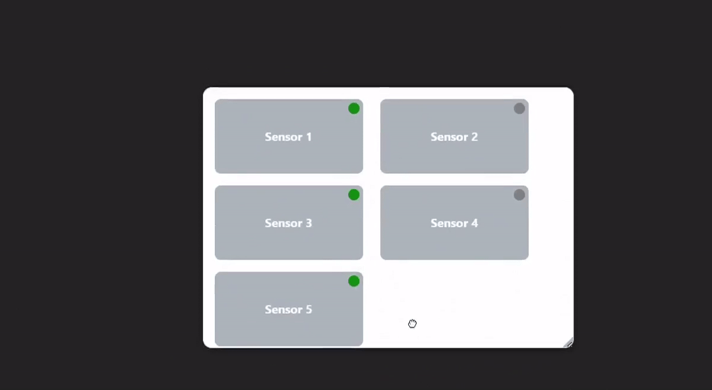

# 📐 Draggable Resizable Container

A modern, responsive, and resizable container component built with React.  
Provides interactive UI for dragging, resizing, and dynamic data display — ideal for sensor panels, dashboards, or modular UIs.

---

## 🎬 Live Preview

A quick preview of the component in action:



---

## 🚀 Features

- ⚛️ Built with React
- 🖱️ Drag & resize from bottom-right corner
- 📱 **Fully responsive** layout
- 🔔 Optional sound alert integration
- 🎯 Custom click handling via `onBoxClick`
- 📦 Published on NPM — easy to install
- 🌐 CDN version

---

## 📦 Installation

Install via npm:

```bash
npm install draggable-resizable-container
```

---

# 🔧 Usage

## 🔰 Sample Data Format

Below is an example of the `data` prop passed to `<DraggableResizableContainer />`.

```ts
const data = {
  containers: [
    {
      id: "container-1",
      label: "Engine",
      labelStyle: {
        backgroundColor: "#f0f0f0",  
        border: "1px solid #ccc",     
        borderRadius: "8px",       
        padding: "6px 12px",         
        textStyle: {
          color: "#d32f2f",           
          fontSize: "18px",           
          fontWeight: "bold",        
        }
      },
      buttons: [
        {
          id: "btn-1-1",
          label: "Overheat Alert",
          width: 40,
          currentStage: 1,
          stages: [
            { color: "green" },
            { color: "red", blinked: true },
            { color: "yellow", blinked: true }
          ]
        },
        {
          id: "btn-1-2",
          label: "Maintenance Needed",
          width: 60,
          currentStage: 0,
          stages: [
            { color: "green" },
            { color: "red", blinked: true },
            { color: "yellow", blinked: true }
          ]
        }
      ]
    }
  ]
};
```

## React

```tsx
import DraggableResizableContainer from 'draggable-resizable-container';

return (
    <DraggableResizableContainer
      data={data}
      onButtonStageChanged={({ containerId, buttonId, stageIndex }) =>
        console.log(`Button stage changed: ${containerId} > ${buttonId} > ${stageIndex}`)
      }
    />
  );
}

export default App;
```
## Vanilla Js

```html
<link
  rel="stylesheet"
  href="https://cdn.jsdelivr.net/npm/draggable-resizable-container@latest/dist/draggable-resizable-component.css"
/>
<div id="resizableContainer"></div>

<script src="https://cdn.jsdelivr.net/npm/draggable-resizable-container@latest/dist/draggable-resizable-component.js"></script>
<script>
    const comp = new DraggableResizableContainer({
      containerId: "resizableContainer",
      data: {data},
      onButtonStageChanged: (e) => {
        comp.switchToNextStage(e.buttonId);
      }
    });
  </script>
```

---

## 🧱 Props

| Prop                   | Type                                              | Description                                                              |
| ---------------------- | ------------------------------------------------- | ------------------------------------------------------------------------ |
| `data`                 | `Array<{ id, label, buttons: Button[] }>`         | Contains data for each draggable container box                           |
| `pollingInterval`      | `number`                                          | Optional. Interval for refetching data (in milliseconds). Default: `1000` |                    |
| `onButtonStageChanged` | `({ containerId, buttonId, stageIndex }) => void` | Triggered when any button is clicked and its stage is updated           |

---

## 📐 Responsive & Resizable

- You can resize the component from the **bottom-right corner**.
- Automatically adapts to different screen sizes.
- Suitable for mobile and desktop usage.

---

## 🧪 Live Demo

🌐 **Live URL:**  
🔗 [draggable-resizable-container.vercel.app](https://draggable-resizable-container.vercel.app)


---

## 📁 Project Structure

```
draggable-resizable-container/
│
├── dist/               # Compiled version (to be added for CDN)
├── src/                # Main source code
│   └── DraggableResizableContainer.tsx
├── example/            # Usage examples
├── package.json
└── README.md
```

---

##  Local Development

If you'd like to contribute or test the documentation site locally:

### How to Setup?

```bash
git clone https://github.com/ebubekirkarakurt/draggable-resizable-container.git
```
```bash
cd draggable-resizable-container
```
```bash
npm install
```
```bash
npm run dev
```

---

## 📜 License

MIT License. Contributions are welcome!

---

Made with ❤️ by [@ebubekirkarakurt](https://github.com/ebubekirkarakurt)